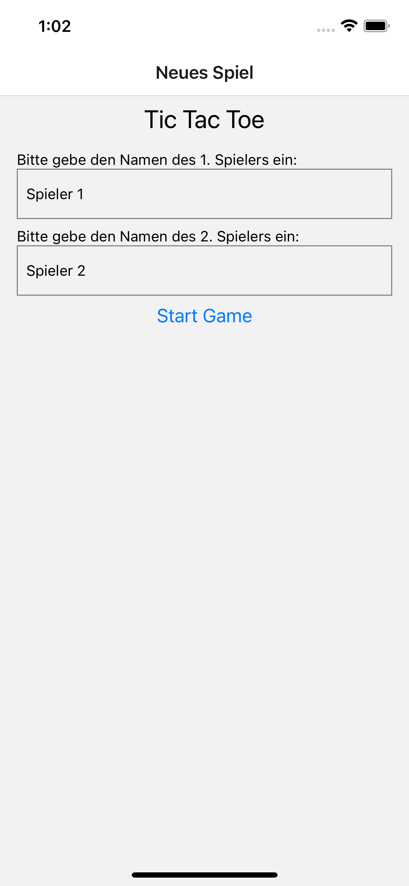
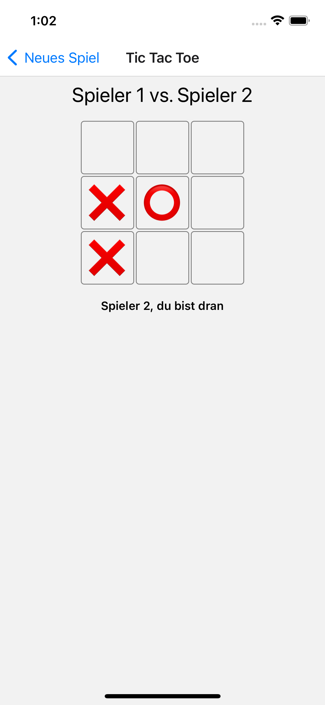
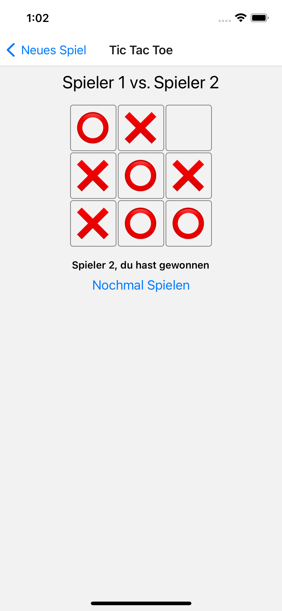

# TIC-TAC-TOE React Native App

---

Written by Fabian Frey

## How to start

---

To start the app, expo-cli must be installed. 
After that just use following commands in the project folder

```
yarn install
npx expo start
```

## Architecture

---

The app demonstrates the separation of React View Components and business logic. 
The logic of the game tic-tac-toe is written in the ```GameService.ts``` class.
It contains the current game state, the current game field, and all actions of both players. 
The interface to the view is the current game state, the current game field, and the playerAction function,
which reacts to the user's input. It reacts to a move and updates all necessary components like the game field.

### List of all Game States:
- ```ACTION_PLAYER1``` (Player1's turn)
- ```ACTION_PLAYER2``` (Player2's turn)
- ```WON_PLAYER1``` (Player1 won, Game is finished)
- ```WON_PLAYER2``` (Player2 won, Game is finished)
- ```DRAW``` (Draw, Game is finished)
- ```ERROR``` (not used)
- ```INIT``` (Initalisation of the Game)

The connection between the View ( ```TTTGameScreen```) and the ```GameServie``` is the hook
```useGame```.

This architecture allows us to add new functionality very fast and easy. For instance, you can start a new game,
just by initiating a new GamerService (as is shown in ```startNewGame``` function).

In addition, testing the logic is easier, because we do not need to render a React Component 
to test any business logic.

The prefix TTT is short for TicTacToe.

## Screenshots

--- 





